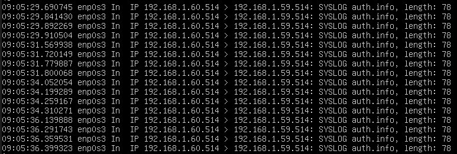
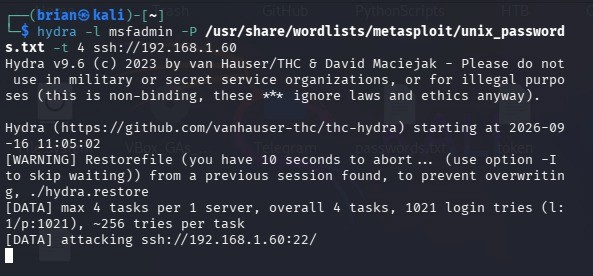
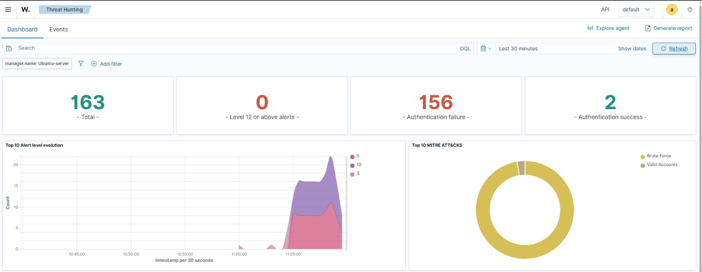
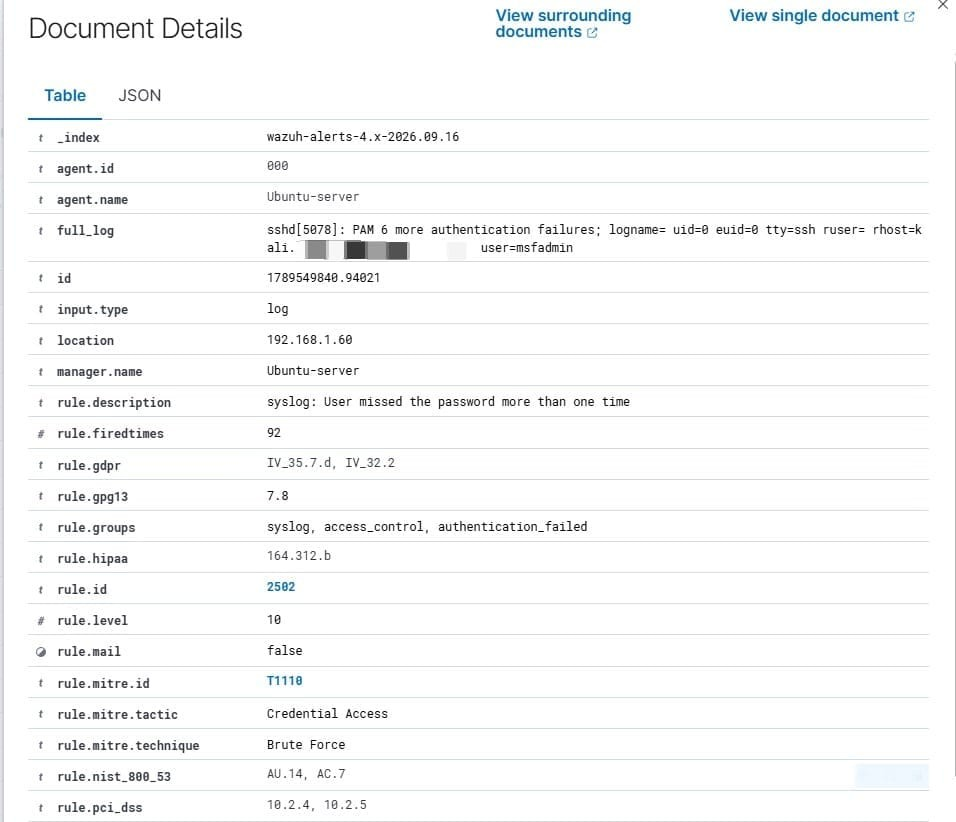

# Detection & Analysis di un Attacco Brute Force SSH tramite SIEM Wazuh

   

Lab di home network security che simula un attacco di dictionary brute force contro un servizio SSH e ne dimostra il rilevamento in tempo reale tramite la piattaforma SIEM/XDR Wazuh, includendo il caso di un target legacy privo di supporto per agent nativi.

## Obiettivo

L'obiettivo non è eseguire un attacco sofisticato, ma dimostrare concretamente come un SIEM riceve, correla e classifica eventi di sicurezza, inclusa la parte meno documentata online: come estendere la visibilità di un SIEM a un sistema troppo vecchio per supportare un agent moderno, tramite syslog forwarding.

> Approfondimenti teorici (SIEM/XDR, architettura Wazuh, MITRE ATT&CK, agent vs syslog) in [`docs/theory.md`](/docs/theory.md).

## Architettura

```text
┌─────────────────────┐         ┌──────────────────────┐
│   Kali Linux        │         │  Metasploitable 2    │
│   (Red Team)        │ ──────> │  (Target)            │
│   192.168.1.X       │  SSH    │  192.168.1.60        │
│   hydra             │  brute  │  sysklogd            │
└─────────────────────┘  force  └───────────┬──────────┘
                                            │ syslog (UDP 514)
                                            │ auth,authpriv.*
                                            ▼
                                  ┌─────────────────────────┐
                                  │  Ubuntu Server          │
                                  │  (Blue Team)            │
                                  │  192.168.1.59           │
                                  │  Wazuh Manager/Indexer/ │
                                  │  Dashboard              │
                                  └─────────────────────────┘
```

|Ruolo|Sistema|IP|Note|
|---|---|---|---|
|Attaccante|Kali Linux|`192.168.1.X`|Esegue l'attacco con Hydra|
|Target|Metasploitable 2|`192.168.1.60`|Sistema legacy (Ubuntu 8.04), nessun agent nativo possibile|
|SIEM Manager|Ubuntu Server 22.04 + Wazuh|`192.168.1.59`|Riceve, correla e classifica gli eventi|

Tutte le VM sono in rete Bridged (non NAT), per simulare una LAN reale con IP assegnati dal router.

## Requisiti

- VirtualBox
- Ubuntu Server 22.04: 4GB+ RAM, 2+ CPU core, 50GB+ disco (l'indexer di Wazuh è pesante; con 25GB l'installazione fallisce a metà per spazio esaurito)
- Kali Linux: 2GB+ RAM
- Metasploitable 2: 512MB RAM

## Installazione

Su Ubuntu Server, installazione Wazuh all-in-one (indexer + manager + dashboard):

```bash
curl -sO https://packages.wazuh.com/4.x/wazuh-install.sh
sudo bash ./wazuh-install.sh -a
```

Deploy dell'agent su Kali dalla dashboard Wazuh (Management → Add Agent → Debian/Ubuntu), poi:

```bash
sudo systemctl daemon-reload
sudo systemctl enable wazuh-agent
sudo systemctl start wazuh-agent
```

Metasploitable 2 non supporta l'agent Wazuh moderno: la sua visibilità è ottenuta tramite syslog forwarding, vedi sezione [Troubleshooting](#troubleshooting).

## Utilizzo

Da Kali, attacco dictionary brute force contro SSH:

```bash
hydra -l msfadmin -P /usr/share/wordlists/metasploit/unix_passwords.txt -t 4 ssh://192.168.1.60
```

- `-l msfadmin`: utente target
- `-P ...`: wordlist di password
- `-t 4`: connessioni parallele

## Troubleshooting

### A. Incompatibilità algoritmi SSH (Kali → Metasploitable)

Hydra fallisce con:

```
[ERROR] could not connect to ssh://192.168.1.60:22 - kex error : no match for method mac algo client->server
```

Causa: Metasploitable 2 supporta solo algoritmi MAC/Kex obsoleti (`hmac-md5`, `hmac-sha1`), disabilitati di default su Kali. Soluzione, in `/etc/ssh/ssh_config` su Kali:

```
Host 192.168.1.60
    MACs hmac-sha1,hmac-md5,hmac-sha1-96,hmac-md5-96
    KexAlgorithms +diffie-hellman-group1-sha1,diffie-hellman-group-exchange-sha1
    HostKeyAlgorithms +ssh-rsa
```

Nota: `MACs` sostituisce la lista di default, `KexAlgorithms`/`HostKeyAlgorithms` con `+` la estendono senza rimuovere gli algoritmi moderni.

### B. Nessun agent nativo su Metasploitable → syslog forwarding

Metasploitable 2 non può eseguire l'agent Wazuh (SO troppo datato). Soluzione: inoltro dei log di autenticazione via syslog UDP.

Su Metasploitable, in `/etc/syslog.conf`:

```
auth,authpriv.*    @192.168.1.59
```

```bash
sudo /etc/init.d/sysklogd restart
```

Su Ubuntu Server, in `/var/ossec/etc/ossec.conf`:

```xml
<remote>
  <connection>syslog</connection>
  <port>514</port>
  <protocol>udp</protocol>
  <allowed-ips>192.168.1.0/24</allowed-ips>
</remote>
```

```bash
sudo /var/ossec/bin/wazuh-control restart
```

Verifica del flusso dati:

```bash
sudo tcpdump -i any port 514 -n
```

## Risultati

| Metrica                                       | Valore                                                 |
| --------------------------------------------- | ------------------------------------------------------ |
| Eventi totali generati                        | 163 alert                                              |
| Tentativi di autenticazione falliti tracciati | 156                                                    |
| Tecnica MITRE ATT&CK                          | T1110 – Brute Force                                    |
| Severità alert                                | Level 5 (auth failure) / Level 10 (brute force attack) |

Wazuh correla temporalmente i tentativi ripetuti dallo stesso IP, alzando la severità a Level 10 invece di trattare ogni fallimento come evento isolato.

## Screenshot

**Traffico syslog ricevuto da Metasploitable:** 
<p align="center">  </p>

**Esecuzione dell'attacco con Hydra:**
<p align="center">  </p>
**Dashboard Wazuh, overview alert:** 
<p align="center">  </p>

**Alert Level 10 con mappatura MITRE ATT&CK T1110:** 
<p align="center">  </p>

## Hardening consigliato

- Disabilitare l'autenticazione a password su SSH (`PasswordAuthentication no`), usare solo chiavi
- Installare fail2ban per bannare automaticamente un IP dopo N tentativi falliti
- Rate limiting a livello firewall (`iptables`/`nftables`, modulo `recent`)
- Wazuh Active Response: bloccare automaticamente l'IP attaccante alla regola ID 5712

## Struttura del progetto

```
wazuh-ssh-bruteforce-detection/
├── README.md
└── docs/
    ├── theory.md
    └── assets/
```

## Limiti del test

Rete LAN virtualizzata senza WAF/IDS di rete/rate limiter intermedi. I valori quantitativi (tentativi/secondo) dipendono dalle risorse assegnate alla VM Kali, non sono comparabili a uno scenario di produzione reale.

## Licenza

Distribuito con licenza MIT. Vedi `LICENSE` per i dettagli.
